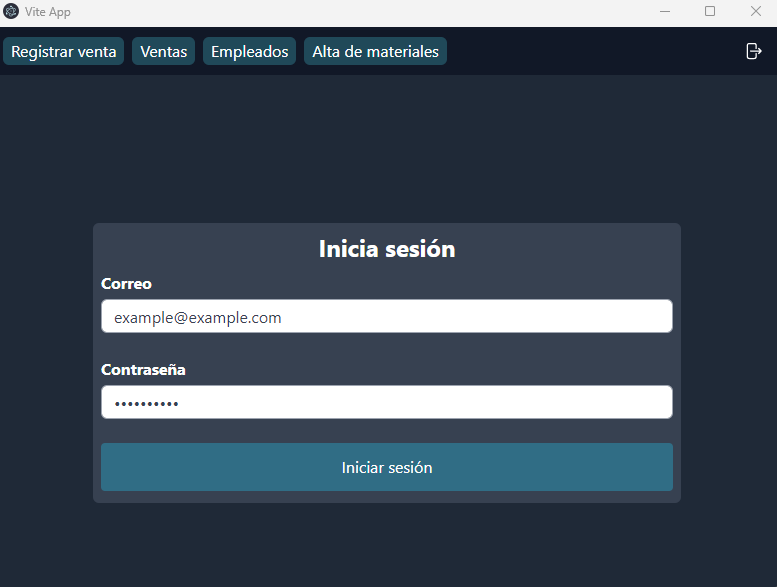
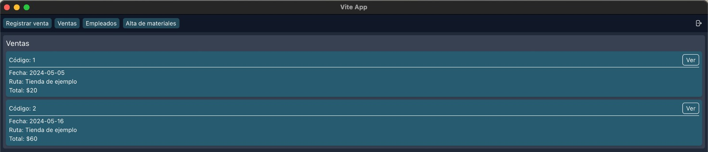
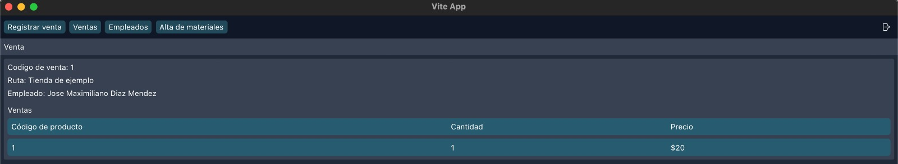
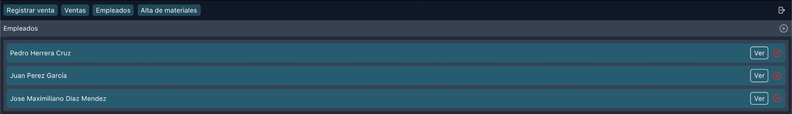

# :shaved_ice: Helados Micro 

Este proyecto implica la creación de la estructura del back de un **_punto de venta para una heladería_**, organizado en servicios dentro de un cluster de kubernetes, los servicios usados son  un [_CRUD_](#repos-utilizados)  y un [_AUTH_](#repos-utilizados), que son implementados en una arquitectura de microservicios.

Se accede a estos micro servicios mediante una [Web_App](#repos-utilizados) escrita en __VUE.js__ y usando __electron.js__ para empaquetarla como app de escritorio que permite interactuar con la arquitectura de __microservicios__.


## Índice

1. [Diagrama de micro servicios generado en Istio](#diagrama-de-microservicios-generado-en-istio)
2. [Arquitectura](#arquitectura)
3. [Testing](#testing)
4. [Repos utilizados](#repos-utilizados)
4. [__Pasos para desplegar el proyecto desde cero__](#pasos-para-desplegar-el-proyecto-desde-cero)
    - [Iniciar Minikube y desplegar el proyecto](#iniciar-minikube-y-desplegar-el-proyecto)
    - [Iniciar Kubernetes en Docker Desktop y desplegar el proyecto](#iniciar-kubernetes-en-docker-desktop-y-desplegar-el-proyecto)
    - [Instalar y configurar Istio](#instalar-y-configurar-istio)
    - [Desplegar el proyecto](#desplegar-el-proyecto)
    - [Probar el proyecto](#probar-el-proyecto) 
6. [Web APP](#web-app)
## Contenido

### Diagrama de micro servicios generado en Istio


### Arquitectura
La arquitectura descrita en el YAML es la siguiente, el documento de manifiesto de Kubernetes sirve para desplegar un cluster de Kubernetes que especifique una arquitectura en especifico.

+ **Un secreto** `db-secrets`__:__ Almacena de forma segura los datos de inicio de sesión de la base de datos, incluyendo el nombre de host, usuario, contraseña y nombre de la base de datos. 

- **Pod** `crud-server`__:__
Ejecuta el servidor CRUD, se replica 2 veces para
proporcionar redundancia y escalabilidad.
El servidor CRUD se comunica con la base de datos
utilizando los datos de inicio de sesión almacenados en
el secreto db-secrets.

+ **Pod** `auth-server`__:__
Ejecuta el servidor de autenticación, que al igual que el
servidor CRUD, se replica 2 veces para garantizar la
disponibilidad. Este servidor utiliza los mismos datos de
inicio de sesión de la base de datos del secreto
db-secrets.

+ **Services** `crud-service` `auth-service`__:__
Exponen los pods crud-server y auth-server,
respectivamente y facilitan la comunicación entre los
diferentes componentes de la aplicación dentro del
clúster de Kubernetes

- **Ingress** `my-ingress`__:__
Punto de entrada externo hacia el clúster, enruta el
tráfico HTTP entrante a los servicios internos
crud-service y auth-service en las rutas `/api/crud`
y `/api/auth` respectivamente. De esta manera, permite
que las solicitudes externas lleguen a los
componentes correspondientes de la aplicación.

- La arquitectura también incluye **`Istio`** como una capa de servicio de
malla, que proporciona funcionalidades como _el enrutamiento, el control de tráfico, la seguridad y la observabilidad_ para los servicios desplegados en el clúster de Kubernetes.
A través de la configuración de _reglas de tráfico y políticas de seguridad_, Istio ayuda a gestionar y asegurar las comunicaciones entre los diferentes componentes de la aplicación.


- **Base de datos:**
Para la base de datos se usa dos instancias de `AWS RDS` (Una de escritura y otra de lectura) que se acceden mediante un __proxy de RDS__ el cuál enruta el tráfico de lectura y escritura a la instancia correspondiente. Además de permitir que en caso de error en la instancia de escritura cambiar la de lectura a escritura durante el tiempo que tome estabilizar la instancia para después sincronizarlas y restablecer sus roles.

### Testing

Para probar __la robustez__ y __la resiliencia__ del sistema, se utiliza **`Chaos Toolkit`**, una herramienta que permite *realizar pruebas de caos de manera controlada*.

Con Chaos Toolkit, se pueden **simular condiciones adversas**, como fallos de red o caídas de servicios, para evaluar cómo responde el sistema en situaciones de estrés. Esto ayuda a identificar posibles puntos débiles y a mejorar la capacidad de recuperación del sistema frente a fallos inesperados.

Aquí fue utilizado para terminar un pod al azar del servidor de autenticación y evaluar la respuesta del cluster a este error fatal, y la libreria corre una serie de instrucciones para probar una teoria, la teoria es que si cae un pod al azar del cluster, el cluster se sigue comportando bien, este fue el output:


Para ejecutar este TEST necesitara tener `python 3` e instalar  chaos toolkit para kubernetes con este comando:
```bash
pip install chaostoolkit chaostoolkit-kubernetes
```
ya que tengamos instalado chaos toolkit, de preferencia en un __entorno virtual__, ejecute este comando para ejecutar la prueba
```bash
chaos run chaosTest.json
```
### Repos utilizados
- https://github.com/Max021311/ctf-web-app (El [cliente de escritorio](#web-app) que consume el API de los servidores)

- https://github.com/Max021311/ctf-crud-microservice (Para generar la imagen de Docker del servidor CRUD)
- https://github.com/Max021311/ctf-auth-microservice (Para generar la imagen de Docker del servidor autenticación)

## Pasos para desplegar el proyecto desde cero

1. Antes que nada sera necesario generar el archivo `secrets.yaml` el cuál debería verse como en el ejemplo, salvo porque se modificarían para usar los correspondientes.
```yaml
# Se crea un secreto para guardar los datos de acceso a la BD.
apiVersion: v1
kind: Secret
metadata:
  name: db-secrets
type: Opaque
stringData:
  # Reemplazar con los datos de acceso correspondiente
  db-host: localhost
  db-user: postgres
  db-name: postgres
  db-password: postgres
```
2. Después sera necesario iniciar ya sea [Minikube](#iniciar-minikube-y-desplegar-el-proyecto) o [Docker desktop](#iniciar-kubernetes-en-docker-desktop-y-desplegar-el-proyecto)
3. Después se tendrá que [instalar y configurar Istio](#instalar-y-configurar-istio)
4. Para finalmente desplegar el proyecto ve como [desplegar el proyecto](#desplegar-el-proyecto)
5. Ahora solo queda [probar el proyecto](#probar-el-proyecto)

### Iniciar Minikube y desplegar el proyecto
En una terminal ejecuta los siguientes comandos

1. Iniciar Minikube con `minikube start`
2. Habilitar la extensión de Ingress `minikube addons enable ingress`
3. Crear el túnel para poder acceder al Ingress `sudo minikube tunnel`

### Iniciar Kubernetes en Docker Desktop y desplegar el proyecto 
La siguiente [guía](https://docs.docker.com/desktop/kubernetes/) esta basada en la guía oficial de docker desktop.

1. Abrir docker desktop
2. Ir a Configuraciones>Kubernetes
3. Marcar la casilla para habilitar Kubernetes
4. Dar clic en el botón para aplicar y guardar cambios.
5. Espera a que termine de iniciar Kubernetes
6. Para que el Ingress funcione de forma correcta es necesario ejecutar el siguiente comando para usar el controlador ingress-nginx.
```bash
kubectl apply -f https://raw.githubusercontent.com/kubernetes/ingress-nginx/controller-v1.10.1/deploy/static/provider/cloud/deploy.yaml
```

### Instalar y configurar Istio

1. Instalar `istioctl` en tu computadora (https://istio.io/latest/docs/setup/getting-started/#download).
2. Instalar Istio en el cluster con `istioctl install --profile=demo -y`
3. Habilitar la inyección de Istio a los pods con `kubectl label namespace default istio-injection=enabled`
4. Instalar Kiali en el cluster.
```bash
kubectl apply -f https://raw.githubusercontent.com/istio/istio/release-1.21/samples/addons/kiali.yaml
```

5. Instalar Prometheus en el cluster.
```bash
kubectl apply -f https://raw.githubusercontent.com/istio/istio/release-1.21/samples/addons/prometheus.yaml
```
6. Abrir dashboard de Kiali con `istioctl dashboard kiali`

### Desplegar el proyecto

1. Desplegar el proyecto `kubectl apply -f manifest.yaml`
2. Sobreescribir los secrets para la base de datos creando el archivo `secrets.yaml` con los secrets verdaderos y aplicándolo en el clúster con `kubectl apply -f secrets.yaml`

### Probar el proyecto

1. `curl http://$(minikube ip)/api/crud/ok` en Linux o `curl http://127.0.0.1/api/crud/ok` en MacOS
2. Lo mismo que en el paso anterior pero con la ruta `/api/auth/ok`

Ahora descarga el repositorio https://github.com/Max021311/ctf-web-app y ejecuta el proyecto siguiendo el README.md.
Sera necesario que configures las variables de entorno `VITE_AUTH_SERVER_HOST` y `VITE_CRUD_SERVER_HOST` a la respectiva IP donde se expone el Ingress y en su respectiva ruta.

## Web APP
La APP de escritorio sirve como una forma de conectarse a toda la estructura de kubernetes para hacer sus funciones normales, desde la app realmente nada cambia pero con esta estructura nos aseguramos de la integridad de la comunicacion en el back y de su disponibilidad indefinida.



Una vez adentro de la aplicacion de escritorio bastara con usar las credenciales predeterminadas:

```
   email -> example@example.com
password -> **********
```
Y tendras acceso a las funciones del CRUD como la de __registrar ventas, ver las ventas, los empleados y subir materiales__:




---
### Finalmente, realizamos un video para explicar su funcionamiento y testeo en tiempo real.
 Link de youtube: https://youtu.be/6V7sdCSvdeI

 ---
