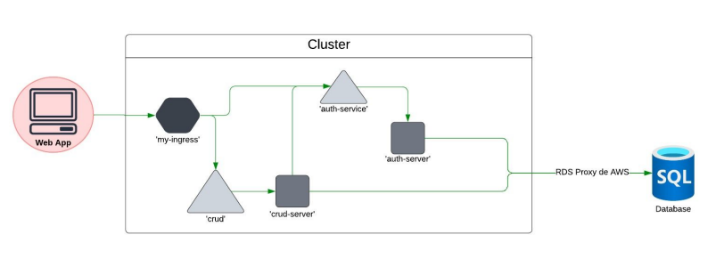

# Helados Micro

Este proyecto implica la creación de un **_punto de venta para una heladería_**, organizado en una app de _microservicios_, que controla el [_CRUD_](#repos-utilizados) y el [_AUTH_](#repos-utilizados), junto con una [Web_App](#repos-utilizados) escrita en __VUE.js__ y envuelta en __electron.js__ para interactuar con la app de microservicios.


## Índice

1. [Diagrama de Microservicios generado en Istio](#diagrama-de-microservicios-generado-en-istio)
2. [Arquitectura](#arquitectura)
3. [Testing](#testing)
4. [Repos utilizados](#repos-utilizados)
4. __Cómo lanzar el proyecto__
    - [Cómo lanzar el proyecto en Minikube](#cómo-lanzar-el-proyecto-en-minikube)
    - [Cómo lanzar el proyecto usando la integración de Kubernetes en Docker Desktop](#cómo-lanzar-el-proyecto-usando-la-integración-de-kubernetes-en-docker-desktop)
    
    - [Instalar y configurar Istio](#instalar-y-configurar-istio)
    - [Desplegar el proyecto](#desplegar-el-proyecto)
    - [Probar el proyecto](#probar-el-proyecto)
## Contenido
### Diagrama de Microservicios generado en Istio

### Arquitectura
La arquitectura descrita en el yaml es la siguiente, el documento de manifiesto de kubernetes sirve para desplegar un cluster de kubernetes que especifique una arquitectura en especifico.

+ **Un secreto** `db-secrets`__:__ Almacena de forma segura los datos de inicio de sesión de la base de datos, incluyendo el nombre de host, usuario, contraseña y nombre de la base de datos. 

- **Pod** `crud-server`__:__
Ejecuta el servidor CRUD, se replica 2 veces para
proporcionar redundancia y escalabilidad.
El servidor CRUD se comunica con la base de datos
utilizando los datos de inicio de sesión almacenados en
el secreto db-secrets.

+ **Pod** `auth-server`__:__
Ejecuta el servidor de autenticación, que al igual que el
servidor CRUD, se replica 2 veces para garantizar la
disponibilidad. Este servidor utiliza los mismos datos de
inicio de sesión de la base de datos del secreto
db-secrets.

+ **2 servicios internos** `crud-service` `auth-service`__:__
Exponen los pods crud-server y auth-server,
respectivamente y facilitan la comunicación entre los
diferentes componentes de la aplicación dentro del
clúster de Kubernetes

- **Ingress** `my-ingress`__:__
Actúa como punto de entrada a la aplicación desde el exterior del clúster,
enruta el tráfico HTTP entrante a los servicios internos crud-service y
auth-service según las rutas especificadas.
De esta manera, permite que las solicitudes externas lleguen a los
componentes correspondientes de la aplicación.

- La arquitectura también incluye **`Istio`** como una capa de servicio de
malla, que proporciona funcionalidades como _el enrutamiento, el control de tráfico, la seguridad y la observabilidad_ para los servicios desplegados
en el clúster de Kubernetes.
A través de la configuración de _reglas de tráfico y políticas de seguridad_,
Istio ayuda a gestionar y asegurar las comunicaciones entre los
diferentes componentes de la aplicación.
### Testing

Para testear la robustez y la resiliencia del sistema, se utiliza **`Chaos Toolkit`**, una herramienta que permite *realizar pruebas de caos de manera controlada*.

 Con Chaos Toolkit, se pueden **simular condiciones adversas**, como fallos de red o caídas de servicios, para evaluar cómo responde el sistema en situaciones de estrés. Esto ayuda a identificar posibles puntos débiles y a mejorar la capacidad de recuperación del sistema frente a fallos inesperados.

 Aqui fue utilizado para tumbar un servidor al azar y evaluar la respuesta del cluster a este error fatal.

 
### Repos utilizados
- https://github.com/Max021311/ctf-web-app (El cliente de escritorio que consume el API de los servidores)
- https://github.com/Max021311/ctf-crud-microservice (Para generar la imagen de Docker del servidor CRUD)
- https://github.com/Max021311/ctf-auth-microservice (Para generar la imagen de Docker del servidor autenticación)

## Como lanzar el proyecto en minikube

Antes que nada sera necesario generar el archivo `secrets.yaml` el cuál debería verse como en ejemplo, salvo porque se actualizarían lo valores de los secretos por los correspondientes.
```yaml
# Create a secret to store the db login data
apiVersion: v1
kind: Secret
metadata:
  name: db-secrets
type: Opaque
stringData:
  # Replace with the real login data
  db-host: localhost
  db-user: postgres
  db-name: postgres
  db-password: postgres
```

### Iniciar Minikube y desplegar el proyecto
En una terminal ejecuta los siguientes comandos

1. Iniciar Minikube con `minikube start`
2. Habilitar el plugin de Ingress `minikube addons enable ingress`
3. Crear el tunel para poder acceder al Ingress `sudo minikube tunnel`

## Como lanzar el proyecto usando la integración de Kubernetes en Docker Desktop

Antes que nada sera necesario actualizar el manifest.yaml para que utilice los datos de accesos correctos para la base de datos ya que estan configurados los valores por defecto de una instancia de PostgreSQL que pueden no ser los correctos.

### Iniciar Kubernetes en Docker Desktop y desplegar el proyecto (https://docs.docker.com/desktop/kubernetes/)

1. Abrir docker desktop
2. Ir a Configuraciones>Kubernetes
3. Marcar la casilla para habilitar Kubernetes
4. Dar clic en el boton para aplicar y guardar cambios.
5. Espera a que termine de iniciar Kubernetes
6. Para que el Ingress funcione de forma correcta es necesario ejecutar el siguiente comando para usar el controlador ingress-nginx.
```bash
kubectl apply -f https://raw.githubusercontent.com/kubernetes/ingress-nginx/controller-v1.10.1/deploy/static/provider/cloud/deploy.yaml
```

### Instalar y configurar Istio

1. Instalar `istioctl` en tu computadora (https://istio.io/latest/docs/setup/getting-started/#download).
2. Instalar Istio en el cluster con `istioctl install --profile=demo -y`
3. Habilitar la inyección de Istio a los pods con `kubectl label namespace default istio-injection=enabled`
4. Instalar Kiali en el cluster.
```bash
kubectl apply -f https://raw.githubusercontent.com/istio/istio/release-1.21/samples/addons/kiali.yaml
```

5. Instalar Prometheus en el cluster.
```bash
kubectl apply -f https://raw.githubusercontent.com/istio/istio/release-1.21/samples/addons/prometheus.yaml
```
6. Abrir dashboard de Kiali con `istioctl dashboard kiali`

### Desplegar el proyecto

1. Desplega el proyecto `kubectl apply -f manifest.yaml`
2. Sobreescribir los secrets para la base de datos creando el archivo `secrets.yaml` con los secrets verdaderos y aplicandolo en el cluster con `kubectl apply -f secrets.yaml`

### Probar el proyecto

1. `curl http://$(minikube ip)/api/crud/ok` en Linux o `curl http://127.0.0.1/api/crud/ok` en MacOs
2. Lo mismo que en el paso anterior pero con la ruta `/api/auth/ok`

Ahora descarga el repo https://github.com/Max021311/ctf-web-app y ejecuta el proyecto siguiente el README.md y configurando las variables de entorno `VITE_AUTH_SERVER_HOST` y `VITE_CRUD_SERVER_HOST` a la respectiva IP donde se expone el Ingress y en su respectiva ruta.
